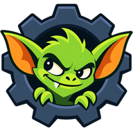

<p align="center">
  
</p>

# GearGremlin

A Fusion 360 add-in that turns sketch circles into involute spur gear profiles that mesh, tooth for tooth, with their neighbours. It also turns sketch lines into racks, and lays out complete planetary gear sets.

Draw circles where you want gears, constrain them tangent, and GearGremlin does the rest:

- sizes each circle to an exact pitch diameter;
- draws the teeth;
- rotates each gear so its teeth line up with the gear it meshes with.

## Features

- **Involute spur gears**, external or internal (ring gears). Module, pressure angle (14.5°, 20°, 25°), tooth count, and backlash are all settable.
- **Hybrid sizing.** Pick a module and GearGremlin suggests the tooth count that best fits your circle, then resizes the circle to the exact pitch diameter. Tangent constraints keep meshing gears correctly spaced.
- **Automatic mesh alignment.** Set *Mesh with* to an existing gear and the teeth are phased so a tooth faces a gap at the contact point. It works for external pairs, for pinions inside ring gears, and for a gear and a rack.
- **Realistic tooth roots.** Roots are generated the way a hob cuts them (an ISO 53 profile A rack cutter). Small gears get a proper undercut, and large gears get a root fillet.
- **Racks.** Select a line instead of a circle and GearGremlin draws a rack along it: straight-sided teeth with the same cutter-shaped roots as the gears, on whichever side you choose, with an optional solid backing so it extrudes straight away. The line is resized to a whole number of teeth. Mesh a gear with a rack (or a rack with a gear) and the teeth line up, with the pair's contact ratio and any interference reported.
- **Ring tip trimming.** Small pinions inside a ring would collide with the ring's tips. GearGremlin shortens the ring's tips just enough to clear the pinion over a full turn, and tells you which pinion set the trim.
- **Tooth height factor.** Standard (1.0), Stub (0.8), or a custom value, with the valid range shown live.
- **Contact-ratio checks.** Each pair's contact ratio is shown. Warnings explain how to fix a low one.
- **Planetary Set command.** Pick a module, sun and planet tooth counts, and a number of planets. GearGremlin:
  - checks that the planets fit evenly and clear each other, and that both meshes run cleanly;
  - suggests nearby tooth counts if they don't;
  - shows the gear ratio;
  - draws all the pitch circles, fully constrained, ready to turn into gears.
- **Edit Gear.** Right-click any gear or rack (its circle or line, or a tooth) to reopen it with its settings. Extrudes and revolves made from the gear stay attached to its new shape, even when the tooth count changes, and keep their extent settings.
- **Remembered settings.** Module, pressure angle, tooth height, gear type, and backlash carry over between runs, so making the second gear of a pair takes no retyping.

## Installation

1. Clone or download this repository into Fusion's add-ins folder. Keep the folder name `GearGremlin`, since Fusion matches the folder, the `.manifest` file, and `GearGremlin.py` by name.
   - **Windows:** `%APPDATA%\Autodesk\Autodesk Fusion 360\API\AddIns\GearGremlin`
   - **macOS:** `~/Library/Application Support/Autodesk/Autodesk Fusion 360/API/AddIns/GearGremlin`
2. In Fusion, open **Utilities → Add-Ins → Scripts and Add-Ins**. Select **GearGremlin** on the Add-Ins tab and click **Run**. Tick **Run on Startup** to load it automatically.

The commands appear in the **Sketch → Create** panel.

GearGremlin is pure Python with no dependencies beyond Fusion's bundled interpreter.

## Usage

### Making a pair of gears

1. In a sketch, draw two circles roughly where the gears go. Add a **tangent** constraint between them.
2. Select the first circle and run **GearGremlin**.
3. Choose a module and adjust anything else, then press **OK**. The circle is resized to its pitch diameter and turned into construction geometry, and the teeth are drawn around it.
4. Select the second circle, run **GearGremlin**, and set **Mesh with** to the first gear's circle. The module, pressure angle, and tooth height are locked to match, and the teeth line up.

The live preview and the info box show the pitch diameter, tip and root diameters, the contact ratio, and any warnings.

### Making a rack

1. In a sketch, draw a line where the rack's pitch line should go (solid or construction). Its start is where the rack begins.
2. Select the line and run **GearGremlin**. The dialog switches to rack settings.
3. Choose a module and tooth height as for a gear. Then:
   - **Flip side** puts the teeth on the other side of the line. Check the preview.
   - **Offset along line** slides the teeth along the line.
   - **Resize line to whole teeth** moves the line's end so it holds a whole number of teeth (one tooth every π × module).
   - **Backing thickness** is the solid strip below the tooth roots. Set it to 0 to draw only the toothed edge.
4. Press **OK**. The line becomes construction geometry and the rack outline is drawn as one closed region, ready to extrude.

A rack made with the same module, pressure angle, tooth height, and backlash as a gear has matching teeth.

To mesh a gear with a rack, draw the gear's circle on the teeth side of the rack's line and constrain it **tangent** to the line. Then either:

- make the rack first, then run GearGremlin on the circle and set **Mesh with** to the rack's line; or
- make the gear first, then run GearGremlin on the line and set **Mesh with** to the gear's circle.

The teeth are lined up at the contact point and the tooth height is locked to the partner's. The rack's *Offset along line* (or the gear's *Rotation offset*) is added after the alignment.

### Making a planetary set

1. In a sketch, run **Planetary Set** and pick a center point (the sketch origin works).
2. Set the sun teeth, planet teeth, and number of planets. The dialog shows each rule passing or failing, the results, and suggestions if something fails.
3. Press **OK** to draw the constrained pitch circles.
4. Turn them into gears with **GearGremlin** in this order: the sun, then each planet (*Mesh with*: sun), then the ring (*Mesh with*: any planet). Each circle opens with its gear type, tooth count, and *Mesh with* already filled in.

### Editing a gear or rack

Right-click a gear's circle, a rack's line, or one of their teeth and choose **Edit Gear**, or run GearGremlin with it selected. Change any setting and press **Update**.
- Extrudes and revolves built on the gear or rack follow the new shape.
- If an edit puts a neighbouring gear or rack out of phase, a warning names it so you can edit that one too.

### Tips

- The default backlash is 0.05 mm. At exactly 0, meshing teeth touch, and Fusion splits the space between them into extra sketch regions. 3D-printed gears usually want 0.1–0.2 mm.
- Gears below about 17 teeth (at 20°) are undercut. They clear their mates, but their teeth are thinner at the base and weaker.
- Gears made by GearGremlin store their settings as attributes on the pitch circle, and racks on the pitch line (group `GearGremlin`). That's how *Mesh with* and *Edit Gear* find them.

## Limitations

- Spur gears and racks only: no helical, bevel, or worm gears, or profile shift.
- Only the toothed profile is drawn. A ring gear's outer rim and any bores are up to you.
- Keeping features attached through an edit covers extrudes and revolves in parametric designs. Features that pick individual tooth edges (for example a fillet on one tooth) can still break when the tooth shape changes.
- Previews of large gears and long racks in busy sketches take a few seconds, mostly Fusion's own time to create the curves (a 200-tooth rack previews in about 2.5 s, a 200-tooth gear in about 5 s).

## Development

### Layout

| Path | What's there |
|---|---|
| `gearmath.py` | All the geometry, in pure Python with no `adsk` imports: involutes, the generated root, ring tip trim, contact ratio, tooth height range, mesh alignment, racks, planetary rules, validation, and an SVG debug writer. |
| `commands/gearProfile/` | The GearGremlin and Edit Gear commands: dialog (`entry.py`), sketch drawing, resizing, editing and feature re-pointing (`drawing.py`), the same for racks (`rack_drawing.py`), remembered settings (`settings.py`). |
| `commands/planetary/` | The Planetary Set command (`entry.py`) and its drawing (`layout.py`). |
| `commands/common/` | Dialog inputs shared by both commands. |
| `lib/fusionAddInUtils/` | Fusion's add-in template helpers. Errors are also appended to `gear_gremlin.log` in the add-in folder. |
| `tests/` | pytest tests for `gearmath.py`. |
| `dev_scripts/` | Tests and tools that run inside Fusion, plus the SVG and icon generators. |

Coordinates are millimetres in `gearmath.py`. The Fusion layer converts to centimetres, Fusion's internal unit, at the boundary.

### Running the tests

The gear math is tested without Fusion:

```
pip install pytest
python -m pytest tests
```

The tests include full-rotation collision sweeps for small gears and planets in rings, so the run takes about a minute and a half.

To regenerate the SVG previews (written to `tests/out/`):

```
python dev_scripts/svg_preview.py
```

The scripts in `dev_scripts/test_*.py` exercise the sketch-drawing code inside a running Fusion session (for example through Fusion's MCP server). Each creates a new scratch design and prints PASS/FAIL lines, also written to `tests/out/`. They have this repository's install path hard-coded in `ROOT` at the top, so change it if yours differs.

After changing the add-in's code, stop and restart GearGremlin in **Scripts and Add-Ins** to load it.
